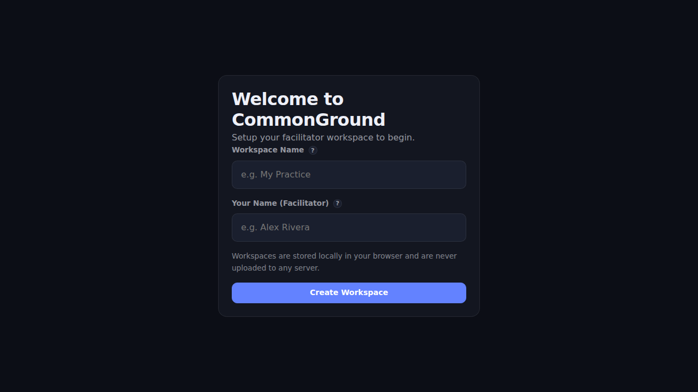

# 🤝 CommonGround Suite

> **Facilitator-first human-systems resolution suite. Resolve clearly.**

Welcome to **CommonGround**, a private, structured workspace designed specifically for facilitators to manage the full arc of conflict resolution, negotiations, team health, performance conversations, and change management. 

---

## 🌟 The Core Value Proposition

CommonGround Suite empowers facilitators with a dedicated, professional environment to organize unstructured human challenges into clear, actionable workflows. It acts as your secure digital hub to guide the complex process of human-systems resolution from intake to complete resolution, ensuring nothing falls through the cracks.

## 🔒 Offline & Privacy Guarantees

Your data belongs exclusively to you. We've built CommonGround with a strict **100% offline-first sovereign architecture**:
- **Zero Servers & Zero Telemetry:** There are no backend databases, no accounts, and absolutely no telemetry. 
- **Absolute Privacy:** Everything is stored directly in your device's local browser storage. Your sensitive facilitation data **never** leaves your device.
- **Zero Cloud Lock-in:** You can export or destroy your entire workspace at any time.

## ✨ Key Features

- **Structured Workspaces & Matters:** Create named workspaces and open matters for conflict, negotiation, team health, or change facilitation.
- **Suitability Screening:** Mandatory non-skippable safety gates surface route-out triggers early, ensuring high-integrity risk screening before any engagement.
- **Dynamic Issue Mapping:** Build clear, structured issue maps with priority levels.
- **Session & Commitment Tracking:** Record agendas and track owner, due dates, and statuses for every commitment made during your sessions.
- **Specialist Briefing Packs:** Automatically generate specialist briefings for your specific matter type.
- **Portable JSON Backups:** Securely download a full archive packet of your workspace as a portable JSON bundle.
- **BYOAI Facilitator Overlay:** Bring your own AI for an optional, fully additive intelligent facilitator companion.
- **Beautiful, Native-like Interface:** A seamless, responsive PWA interface that functions perfectly entirely offline and works everywhere.

## 🚀 Getting Started & Best Practices

### 1. Launch the App
No installation, no downloads, no accounts required! Simply visit the live URL:
👉 **[Launch CommonGround Suite](https://shfqrkhn.github.io/CommonGround/)**

### 2. Install as a PWA (Recommended)
For the best native-like experience and guaranteed offline availability:
- **Desktop:** Open the link in Chrome/Edge and click the "Install" icon in the address bar.
- **Mobile:** Open the link in Safari/Chrome and tap **Share → Add to Home Screen**.

### 3. ⚠️ Critical Data Management Advice
Because CommonGround stores data *only* on your device, **clearing your browser's site data or history will erase your workspaces permanently.** 
- **Back Up Frequently:** Go to **Settings → Export** to download a portable `.json` backup of your data. Store this file safely.
- **Restore Anywhere:** Use **Settings → Import** to reload your snapshot on any device.
- **Full Control:** Use **Settings → Factory Reset** when you need to wipe your device thoroughly.

---
*Current Release: `version 0.1.129`*
*Browser Support: Chrome, Edge, Firefox, Safari (iOS 16.4+).*
